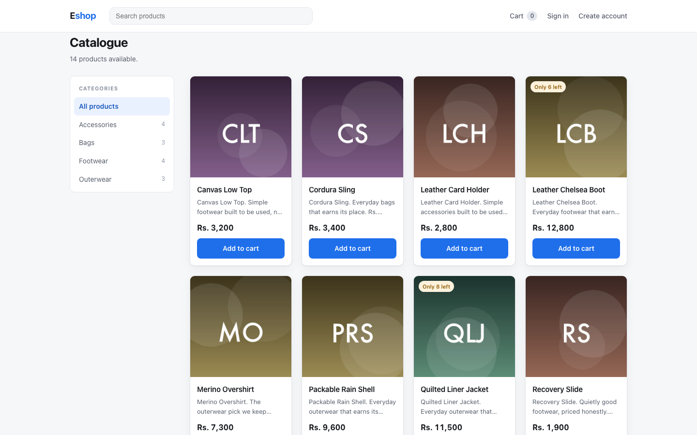
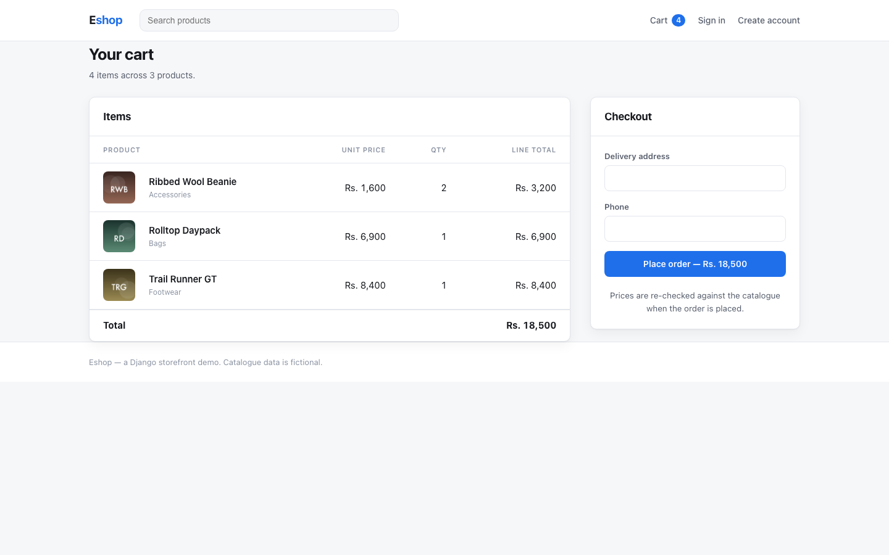
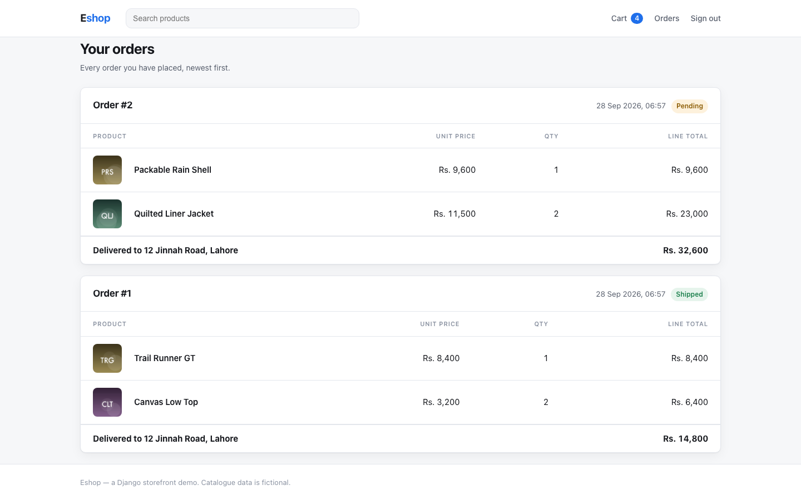
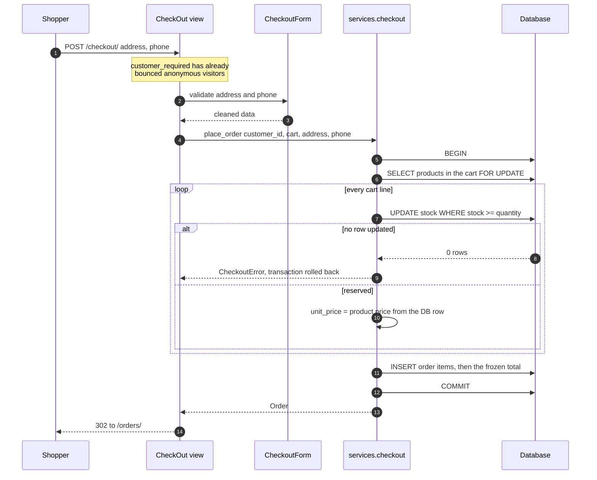
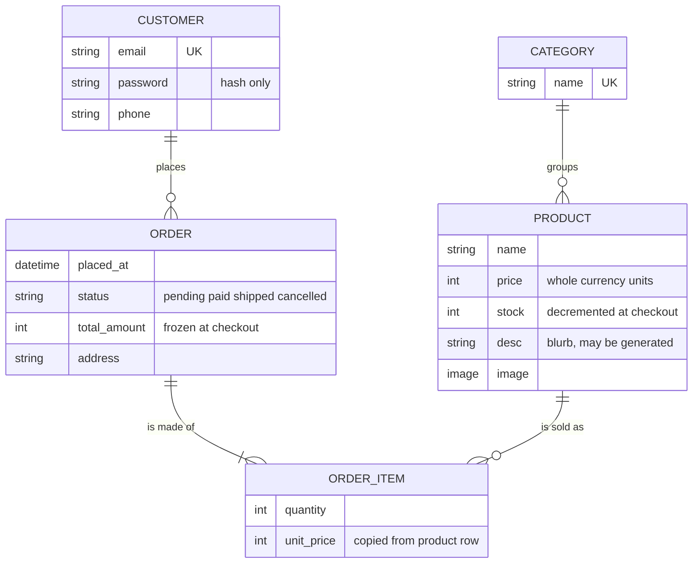

# Eshop

A server-rendered Django storefront: browse a catalogue, fill a cart, check out,
and look back at your orders. No JavaScript framework, no REST layer — Django
templates and form posts, which is the whole point.



## Get it running

Needs Python 3.11+ (developed and tested on 3.12).

```bash
python -m venv .venv && source .venv/bin/activate
pip install -r requirements-dev.txt

cp .env.example .env          # DJANGO_DEBUG=true is already set for local work
python manage.py migrate
python manage.py seed_demo    # 4 categories, 14 products, a shopper, 2 orders
python manage.py runserver 7181
```

Open <http://127.0.0.1:7181/>. The seeded shopper is `demo@example.com` /
`demo-password`; `seed_demo` draws its own product artwork with Pillow, so it
needs no network. For `/admin/`, add a superuser with
`python manage.py createsuperuser`.

## What a shopper can do

Search by product name, filter by category, page through the results. Cards show
stock warnings (`Only 6 left`) and disable the button when stock hits zero.

| Cart | Orders |
| --- | --- |
|  |  |

The cart lives in the session, so an anonymous visitor can fill one. Checkout is
where an account becomes necessary: `/checkout/` and `/orders/` are wrapped in
`customer_required`, which redirects to `/login/?next=…` and comes back.

## How a cart becomes an order

Everything that decides *what happens* lives in `brand/services/`. Views parse
the request, call one service function, and render — nothing else. The rule the
checkout service exists to enforce is that **no money on an order comes from the
request body**.



Two properties fall out of that shape, and each has a test that fails if it is
lost (`tests/test_checkout_service.py`):

- **Stock cannot go negative.** The reservation is a conditional
  `UPDATE … WHERE stock >= quantity`. Two simultaneous checkouts for the last
  unit cannot both succeed, because the second one updates zero rows. The whole
  function is `@transaction.atomic`, so a failure halfway through a multi-line
  cart leaves no order and no decremented stock behind.
- **Order history does not move.** `OrderItem.unit_price` is copied from the
  product row at checkout time, and `Order.total_amount` is the sum of the
  lines. Repricing a product later does not rewrite what someone already paid.

## What the database holds



An order is a header plus lines. A checkout of three products is one `ORDER`
with three `ORDER_ITEM` rows, not three separate orders that happen to share a
timestamp.

Prices are `PositiveIntegerField` holding whole currency units — the storefront
is priced in rupees, which have no minor unit in practice, so an integer column
is exact and no float rounding is possible. `STOREFRONT_CURRENCY_PREFIX` decides
how they render.

Queries the templates rely on are kept flat: the sidebar's per-category counts
come from one `annotate(Count("products"))`, the product grid uses
`select_related("category")`, and order history uses
`prefetch_related("items__product")` — two extra queries however many lines the
orders have. `tests/test_catalog_views.py` and `tests/test_order_views.py` each
assert the query count is unchanged after more rows are added, which is the
property that actually matters.

## Signing in

`Customer` is its own model rather than `django.contrib.auth.User`, and
`request.session["customer"]` holds its primary key. Passwords still go through
Django's hashers (`make_password` / `check_password`) — nothing stores a
plaintext password.

Three things the sign-in path does deliberately:

- `sign_in()` calls `session.cycle_key()`, so a session key an attacker planted
  before authentication is not the key that ends up signed in.
- The post-login destination is read per request and passed through
  `url_has_allowed_host_and_scheme`. An off-site `?next=` is discarded and the
  shopper lands on the catalogue instead.
- A failed lookup still runs a password hash, so "unknown email" and "wrong
  password" take similar time and the form does not enumerate accounts.

## Product copy, written locally or by Claude

Products need short blurbs, and writing fourteen of them by hand is exactly the
kind of chore a model is good at. `brand/ai/` puts that behind one interface:

```python
from brand.ai import ProductBrief, get_copywriter

copywriter = get_copywriter()                    # honours COPYWRITER_BACKEND
copywriter.write_blurb(ProductBrief(name="Trail Runner GT",
                                    category="Footwear",
                                    price=8400))
```

`COPYWRITER_BACKEND=local` (the default) generates the blurb from a hash of the
product's own fields: deterministic, offline, no API key. It is what `seed_demo`
and the test suite use, so **the repo runs end to end with no credentials**.

`COPYWRITER_BACKEND=anthropic` calls the Claude API instead. Any failure — SDK
missing, key missing, network down, model declines — logs and falls back to the
local writer rather than breaking the page that asked. The admin exposes it as a
bulk action on `/admin/brand/product/`. A third backend is one class with a
`write_blurb` method plus one branch in `brand/ai/registry.py`.

## Configuration

Every value that differs between a laptop and a server is an environment
variable; `.env.example` is the full list, loaded from `.env` if present.

| Variable | Default | Notes |
| --- | --- | --- |
| `DJANGO_DEBUG` | `false` | |
| `DJANGO_SECRET_KEY` | — | **Required when `DJANGO_DEBUG` is off.** The app raises `ImproperlyConfigured` at import rather than booting with a weak key. |
| `DJANGO_ALLOWED_HOSTS` | `localhost,127.0.0.1` in debug | Comma-separated. |
| `DJANGO_CSRF_TRUSTED_ORIGINS` | empty | Comma-separated absolute origins. |
| `DJANGO_DB_PATH` | `db.sqlite3` | |
| `DJANGO_MEDIA_ROOT` | `pictures` | |
| `STOREFRONT_PAGE_SIZE` | `12` | Product cards per page. |
| `STOREFRONT_CURRENCY_PREFIX` | `Rs. ` | |
| `CART_MAX_QUANTITY_PER_LINE` | `99` | |
| `COPYWRITER_BACKEND` | `local` | `local` or `anthropic`. |
| `ANTHROPIC_API_KEY` | empty | Only read by the `anthropic` backend. |

With `DJANGO_DEBUG` off, secure cookies, `SECURE_CONTENT_TYPE_NOSNIFF`,
`X_FRAME_OPTIONS=DENY` and optional HSTS turn on automatically.
`tests/test_settings_contract.py` re-imports the settings module under different
environments to prove the required-key behaviour.

## Tests and linting

```bash
pytest          # 90 passed
ruff check .    # All checks passed!
ruff format --check .
```

pytest + `pytest-django`, under `tests/`: cart arithmetic and session hygiene,
the checkout guarantees above, the sign-in and redirect rules, form validation,
catalogue paging/search/filtering, the copywriter fallback, the health endpoint,
and the settings contract. `GET /healthz/` returns
`{"status": "ok", "database": "ok"}` after a real `SELECT 1`, and `503` when the
database is unreachable — Compose and the Dockerfile use it as a healthcheck.

## Containers

```bash
export DJANGO_SECRET_KEY="$(python -c 'from django.core.management.utils import get_random_secret_key as k; print(k())')"
docker compose up --build       # http://localhost:7182
```

Two-stage build: the first stage compiles wheels (Pillow needs a toolchain),
the runtime stage installs them and carries no compiler. It runs as the
unprivileged `eshop` user, serves through gunicorn, and lets WhiteNoise handle
the collected static files. Compose migrates, seeds the catalogue, and keeps
SQLite and uploaded images on named volumes.

`docker compose config` parses cleanly. The image has **not** been built or
booted — Docker Desktop is off on the machine this was developed on, so treat
the container path as unverified.

## Known limits

- SQLite only. `place_order` uses `select_for_update()`, which SQLite ignores;
  correctness there rests on the conditional `UPDATE`, which works on both.
  Moving to Postgres is a `DATABASES` change plus a driver.
- `Customer` is separate from `django.contrib.auth.User`, so there is no
  password reset, no email verification, and no permission integration for
  shoppers. Folding it into a custom user model is the right next step.
- Order status is set in the admin. No payment provider, no shipping
  integration, no transition rules between statuses.
- No cache layer. At this data size every page is a handful of indexed queries,
  and adding Redis would be decoration rather than a fix.
